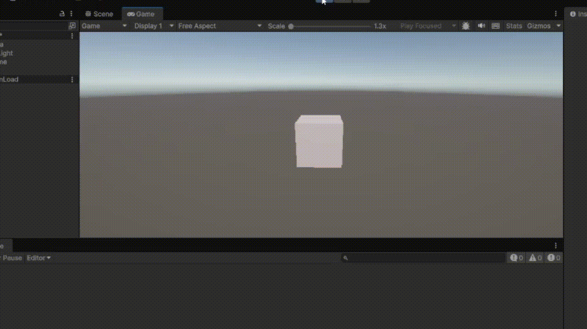

# Interfaces Inteligentes
## Práctica 2. Introducción C#, Scripts
### Alumna: Nailea Fayna Cruz Galván (alu0101477497)

**Descripción:**
En esta práctica se ha propuesto realizar una serie de tareas básicas con el objetivo de aprender C#. En este fichero, explicaré dichas tareas y cómo las llevé a cabo.

### Desarrollo de tareas
---

**1. Crea un script asociado a un objeto en la escena que inicialice un vector de 3 posiciones con valores entre 0.0 y 1.0, para tomarlo como un vector de color (Color). Cada 120 frames se debe cambiar el valor de una posición aleatoria y asignar el nuevo color al objeto. Parametrizar la cantidad de frames de espera para poderlo cambiar desde el inspector.**
Creé un script llamado ChangeColor y lo asocié a un cubo (Llamado ColorCube).
El script inicializa un vector con tres valores gracias a `Random.value`, que devuelve valores entre 0.0 y 1.0 (perfecto para el RGB).
Cada 120 frames (se puede cambiar desde el inspector), se cambia aleatoriamente uno de los tres canales del color y se asigna el nuevo color al material del objeto gracias `material.color`. La elección de cambiar únicamente 1 canal hace que el cambio de colores no sea tan drástico, sino que siempre cambiará a un color parecido al anterior.

