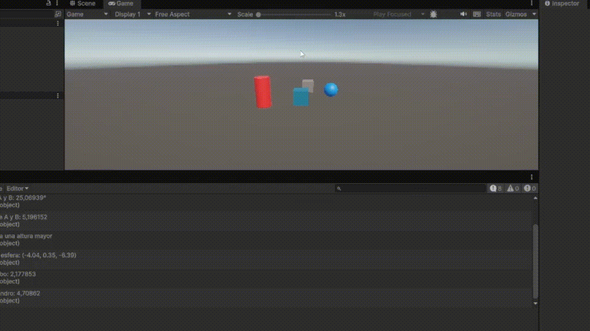
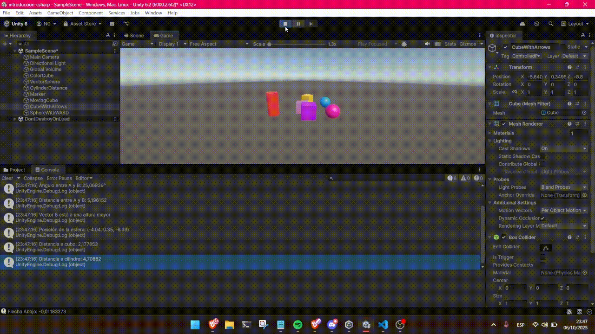

# Interfaces Inteligentes
## Práctica 2. Introducción C#, Scripts
### Alumna: Nailea Fayna Cruz Galván (alu0101477497)

**Descripción:**
En esta práctica se ha propuesto realizar una serie de tareas básicas con el objetivo de aprender C#. En este fichero, explicaré dichas tareas y cómo las llevé a cabo.

### Desarrollo de tareas
---

**1. Crea un script asociado a un objeto en la escena que inicialice un vector de 3 posiciones con valores entre 0.0 y 1.0, para tomarlo como un vector de color (Color). Cada 120 frames se debe cambiar el valor de una posición aleatoria y asignar el nuevo color al objeto. Parametrizar la cantidad de frames de espera para poderlo cambiar desde el inspector.**

Creé un script llamado ChangeColor y lo asocié a un cubo (Llamado ColorCube).
El script inicializa un vector con tres valores gracias a `Random.value`, que devuelve valores entre 0.0 y 1.0 (perfecto para el RGB).
Cada 120 frames (se puede cambiar desde el inspector), se cambia aleatoriamente uno de los tres canales del color y se asigna el nuevo color al material del objeto gracias `material.color`. La elección de cambiar únicamente 1 canal hace que el cambio de colores no sea tan drástico, sino que siempre cambiará a un color parecido al anterior.

**2. Crea un script asociado a la esfera con dos variables Vector3 públicas. Dale valor a cada componente de los vectores desde el inspector. Muestra en la consola: La magnitud de cada uno de ellos, el ángulo que forman, la distancia entre ambos, un mensaje indicando qué vector está a una altura mayor y muestra en el inspector cada uno de esos valores.**

Asocié un script llamado VectorInspector a la esfera, con dos variables públicas Vector3 para poder asignar sus componentes desde el inspector.
El script muestra en la consola lo que se pide en el enunciado al empezar el programa (Más adelante se incluye el pantallazo).

**3. Muestra en pantalla el vector con la posición de la esfera.**

En este caso creé un script llamado ShowPosition que muestra en consola el vector con la posición de la esfera al empezar el juego. Para esto usé la propiedad `transform.position` del componente Transform del GameObject para obtener su posición.

**4. Crea un script para la esfera que muestre en consola la distancia a la que están el cubo y el cilindro.**

Para lograrlo cree un script llamado DistanceToObjects asociado a la esfera. El script busca los objetos Cubo y Cilindro mediante sus etiquetas (FindWithTag) y obtiene sus componentes Transform. Las etiquetas son ColoredCube (para el cubo) y simplemente Cylinder (para el cilindro). Gracias a utilizar `Vector3.Distance()` podemos calcular la distancia entre las posiciones.

-> Consola tras la ejecución de las tareas 2, 3 y 4:

El motivo por el que escogí imprimirlo únicamente con Start() y no con Update() es porque según avanzamos hay más ejercicios que requieren de imprimir por consola y sí que utilizan el Update(), así que para facilitar la lectura del output únicamente dejé lo necesario en Update().

**5. Selecciona tres posiciones en tu escena a través de un objeto invisible (marcador) que incluya 3 vectores numéricos para configurar posiciones en las que quieres ubicar los objetos en respuesta a pulsar la barra espaciadora. Estos vectores representan un desplazamiento respecto a la posición original de cada objeto. Crea un script que ubique en las posiciones configuradas cuando el usuario pulse la barra espaciadora.**

En este apartado añadí un objeto vacío llamado "Marker" que almacena tres vectores públicos con las posiciones de desplazamiento configurables desde el inspector. Cada objeto (cubo, cilindro y esfera) tiene una variable pública de desplazamiento para definir cuánto se moverá respecto a su posición inicial.

El script creado fue MoveOnSpace que detecta la cuando pulsamos la barra espaciadora usando Input.GetAxis("Jump"). Al pulsarla, los objetos se reubican sumando su desplazamiento a la posición que está definida en el marcador.

**6. Agrega un campo velocidad a un cubo y asígnale un valor que se pueda cambiar en el inspector de objetos. Muestra la consola el resultado de multiplicar la velocidad por el valor del eje vertical y por el valor del eje horizontal cada vez que se pulsan las teclas flecha arriba-abajo ó flecha izquierda-derecha. El mensaje debe comenzar por el nombre de la flecha pulsada.**

Este Script es CubeSpeed, con una variable pública velocidad para poder modificarla desde el inspector. El script detecta las teclas de dirección mediante Input.GetAxis("Horizontal") y Input.GetAxis("Vertical"). Cuando se presionan estas flechas, se muestra en la consola un mensaje con el nombre de la flecha pulsada y el resultado de multiplicar su valor de eje (Horizontal o Vertical) por la velocidad.

**7. Mapea la tecla H a la función disparo.**

Para lograrlo, utilicé el Input Manager (`Edit->Project Settings->InputManager->Axes`), donde copie una de las acciones y simplemente le cambié el nombre y la tecla a la que debía reaccionar con Positive Button. 

Luego añadí un Script muy simple llamado "Shooting" asociado al Cilindro para poder ponerlo en uso.

**8. Crea un script asociado al cubo que en cada iteración traslade al cubo una cantidad proporcional un vector que indica la dirección del movimiento: moveDirection que debe poder modificarse en el inspector.  La velocidad a la que se produce el movimiento también se especifica en el inspector, con la propiedad speed. Inicialmente la velocidad debe ser mayor que 1 y el cubo estar en una posición y=0.**

Para esto cree un cubo nuevo al que llamé *MovingCube* y el Script MoveCube. Incluye las tres variables públicas que se piden para poder modificar en el inspector, *move_direction*, *speed* y *use_local_space*. Con esta información el cubo se mueve gracias a utilizar `Translate(x, y, z)`, inicialmente con una velocidad de 2 y manteniendo la dirección del movimiento y=0.

Se analizaron varias situaciones:

  1. Duplicar las coordenadas de la dirección del movimiento. Avanza el doble de rápido en la misma dirección.

  2. Duplicar la velocidad manteniendo la dirección del movimiento. El movimiento se volvió más rápido (speed=4).

  3. La velocidad es menor que 1. El cubo va mucho más lento.

  4. La posición del cubo tiene y>0. El cubo ahora se desplaza hacia arriba (y=2).

  5. Intercambiar movimiento relativo al sistema de referencia local y el mundial. Cuando usamos el sistema de referencia local, el cubo se mueve según su propia orientación. Si usamos el del mundo, utiliza los ejes globales, independientemente de su rotación.

**9. Mueve el cubo con las teclas de flecha arriba-abajo, izquierda-derecha a la velocidad speed. Cada uno de estos ejes implican desplazamientos en el eje vertical y horizontal respectivamente. Mueve la esfera con las teclas w-s (movimiento vertical) a-d (movimiento horizontal).**

En este caso cree dos Scripts diferentes, MoveWithArrows y MoveWithWASD. Para poder especificar las teclas tuve que utilizar KeyCode.tecla, en lugar de Input.GetAxis, ya que este último responde tanto a WASD como a las flechas. Los script se parecen muhco a los anteriores apartados, se mueven gracias a una velocidad (ajustable) y al método `transform.Translate`.

**10. Adapta el movimiento en el ejercicio 9 para que sea proporcional al tiempo transcurrido durante la generación del frame.**

A partir del ejercicio anterior, modificamos los Script para que su desplazamiento sea independiente de los FPS. Esto se hace simplemente añadiendo `Time.deltaTime` en el cálculo del movimiento. De esta forma, el movimiento se vuelve proporcional al tiempo real transcurrido entre frames, en lugar de depender del número de actualizaciones por segundo. Gracias a esto, el movimiento es mucho más natural y menos rápido.

**11. Adapta el movimiento en el ejercicio 10 para que el cubo se mueva hacia la posición de la esfera. Debes considerar que el avance no debe estar influenciado por cuánto de lejos o cerca estén los dos objetos.**

En este caso cree un nuevo Script FollowSphere al que debemos asociarle una esfera. Para lograrlo, se calculó el vector dirección que une al cubo con la esfera y normalizamos el vector para que la magnitud del desplazamiento dependa solo de la velocidad y no de la distancia.

**12. Adapta el movimiento en el ejercicio 11 de forma que el cubo avance mirando siempre hacia la esfera, independientemente de la orientación de su sistema de referencia. Para ello, el cubo debe girar de forma que el eje Z positivo apunte hacia la esfera . Realiza pruebas cambiando la posición de la esfera mediante las teclas awsd**

Ahora creamos el script AdvanceWithSphere y la dierencia es que utilizamos `LookAt()`, con lo que el cubo siempre esta mirando a la esfera y el movimiento es más natural.

**13. Utilizar el eje “Horizontal” para girar el objetivo y que avance siempre en la dirección hacia adelante.**

Por último, creamos el Script RotateHorizontal, en el que el cubo siempre estará avanzando y con las flechas vamos a modificar su rotación para que se mueva. Gracias a `transform.forward`, el cubo se mueve por su cuenta hacia delante.

